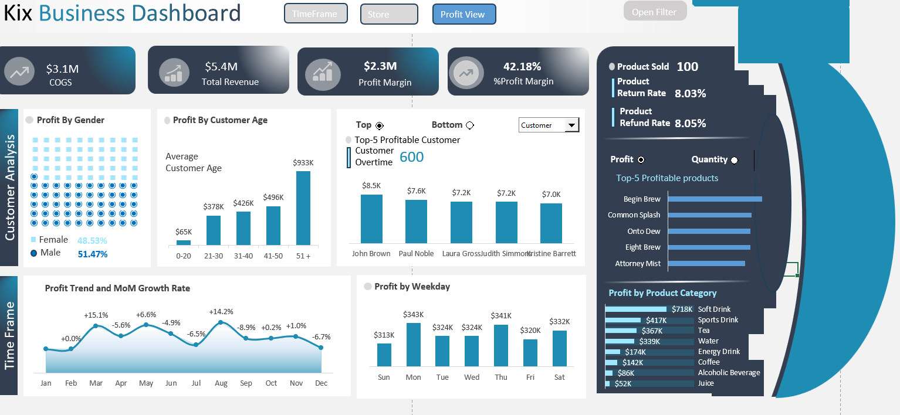

# Kix Beverages Data Analysis Problem Statement

**Objective**

Kix Beverages aims to improve strategic and operational decision-making by analyzing customer behavior, product performance, store revenue, and temporal financial trends. The goal is to develop three interactive dashboards that deliver actionable insights to optimize marketing, inventory, staffing, and financial planning.

# Problem Description

Kix Beverages faces challenges in understanding which customer segments drive the most profit, identifying seasonal and daily profitability patterns, determining top-performing products, assessing store performance against revenue targets, and tracking revenue trends over time. Without clear, data-driven insights, the company struggles to make informed decisions on marketing strategies, inventory management, staffing allocation, and financial planning.

# Proposed Solution

To address these challenges, three dashboards will be developed, leveraging tools like Power Query for data preparation and transformation:

**Dashboard 1: Customer & Product Profitability**

**👥 Customer Analysis:** **_Analyze profit generated by male and female customers and average spending by age group to identify high-value customer segments._**

The profit distribution by gender reveals a fairly balanced contribution between male and female customers, with male customers generating 51.47% of the total profit and female customers contributing 48.53%. While the difference is marginal, the slight edge indicates potential to tailor engagement strategies by gender to further optimize conversions.

When analyzing profit by customer age group, a clear trend emerges: older age groups generate significantly more profit. Customers aged 51 and above contribute the highest profit at $933K, followed by the 41–50 age group at $496K. In contrast, younger demographics (ages 0–20) only account for $65K.

**📈Profitability over Month Periods:** **_Track profit trends and month-over-month growth to uncover seasonal patterns and assess sales effectiveness._**

The month-over-month profitability analysis shows a volatile pattern throughout the year. January starts flat at 0.0%, followed by a strong +15.1% spike in February, likely due to seasonal promotions. March sees a -5.6% drop, indicating campaign fatigue or reduced demand. April rebounds slightly at +6.6%, but May (-4.9%) and June (-6.5%) decline, suggesting a mid-year slowdown. July surges to +14.2%, driven by summer campaigns, but August plummets by -8.9%, the year's largest drop. September (+0.2%) and October (+1.0%) stabilize modestly, yet November unexpectedly falls by -6.7% despite the holiday season. Early December data suggests continued weakness. The business shows strong potential in peak months (February, July) but struggles with inconsistent growth due to sharp downturns. To improve, it should focus on consistent promotional strategies, replicate successful campaigns, investigate low-performing months (August, November), and align marketing with seasonal trends to reduce volatility.

**📅Profitability by Weekday:** **_Identify the most profitable weekdays to optimize staffing and marketing efforts._**

The data on profit by weekday indicates that Monday ($343K) and Thursday ($341K) are the most profitable days, closely followed by Saturday ($332K). Conversely, Friday has the lowest profit ($320K), though the variance across weekdays is moderate.

**📦Product Analysis:** **_Highlight top-selling and most profitable products, alongside return and refund rates, to inform inventory management and product strategy._**

The product analysis reveals that among the 100 products sold, "Begin Brew" stands out as the most profitable item, followed closely by "Common Splash," "Onto Dew," "Eight Mist," and "Attentive Energy." These top five products not only generate the highest profits but also appear to be among the highest in quantity sold, indicating strong market demand and consistent performance. At the category level, Soft Drinks contribute the most to overall profit at $718K, followed by Sports Drinks ($613K) and Tea ($439K). In contrast, categories like Juice and Alcoholic Beverages generate the least profit, suggesting limited sales or lower margins. 

**Dashboard 2: Store Performance & Revenue Tracking**

   

**Store Budget vs. Revenue:** **_Compare actual revenue against targets for each store to identify underperforming or outperforming locations._**
Based on the Kix Business Dashboard, the comparison of store budget versus revenue shows that Novak PLC (-$175.1K, -24.6%), Miller (-$98.6K, -15.3%), Martinez (-$64.8K, -10.8%), and Berg-Trujillo (-$74.3K, -12.4%) are underperforming compared to their targets. Conversely, Valdez (+$53.6K, +10.6%), Thomas (+$51.4K, +10.6%), Myers-Lopez (+$119.2K, +26.7%), Barron-Fleming (+$124.6K, +29.5%), Lopez (+$125.7K, +30.0%), and Lee-Myers (+$130.2K, +31.1%) are outperforming. Overall, the total revenue of $5.4M exceeds the $5.3M target, resulting in a positive variance of $0.1M (+3.7%).

Month-by-Month Analysis: Provide a detailed breakdown of monthly revenue and targets to detect variances and support financial planning.

**Dashboard 3: Time-Based Revenue Performance**
  

**Quarterly Revenue Analysis:** **_Compare quarterly revenue against the average to evaluate performance trends._**

The quarterly revenue trend shows consistent performance with an average of $1 million per quarter. Q2 saw a positive growth of 3.6%, indicating an improvement from Q1. However, Q3 experienced a slight decline of 1.6%, followed by a flat performance in Q4 with a 0.0% change. This pattern reflects a peak in Q2, a minor dip in Q3, and stabilization in Q4, resulting in an overall steady revenue cycle across the year.

Weekday vs. Weekend Revenue: Analyze revenue differences between weekdays and weekends to guide staffing and operational decisions.

Monthly Revenue vs. Target: Track monthly revenue against goals to enable agile financial adjustments.

**Expected Outcomes**

These dashboards will empower Kix Beverages to make data-backed decisions, enhancing customer targeting, product offerings, store operations, and financial strategies, ultimately driving profitability and operational efficiency.
